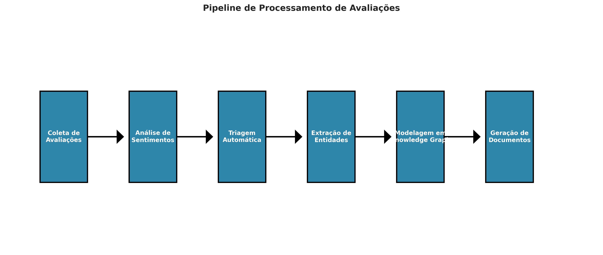
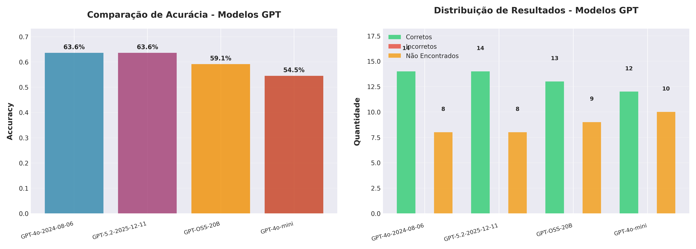
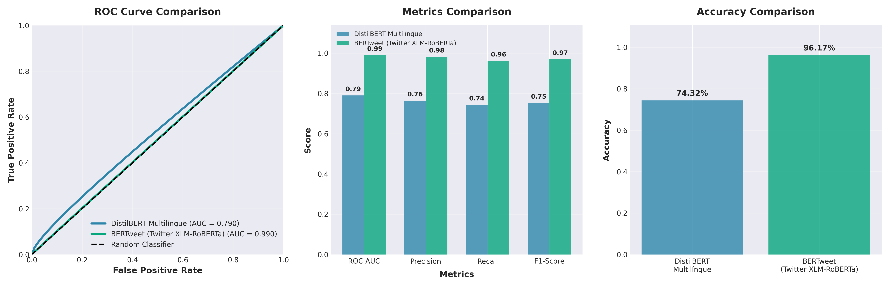
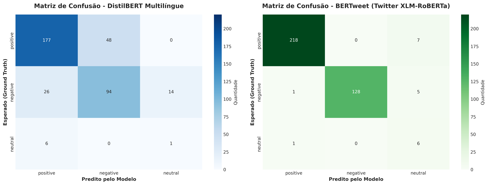
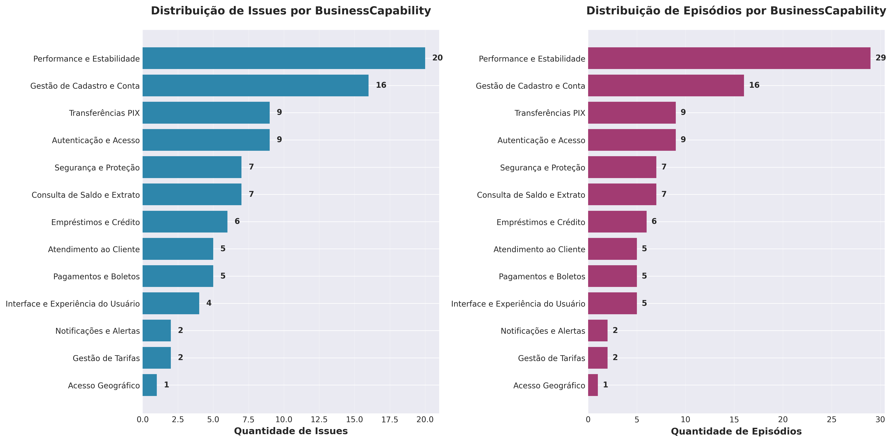
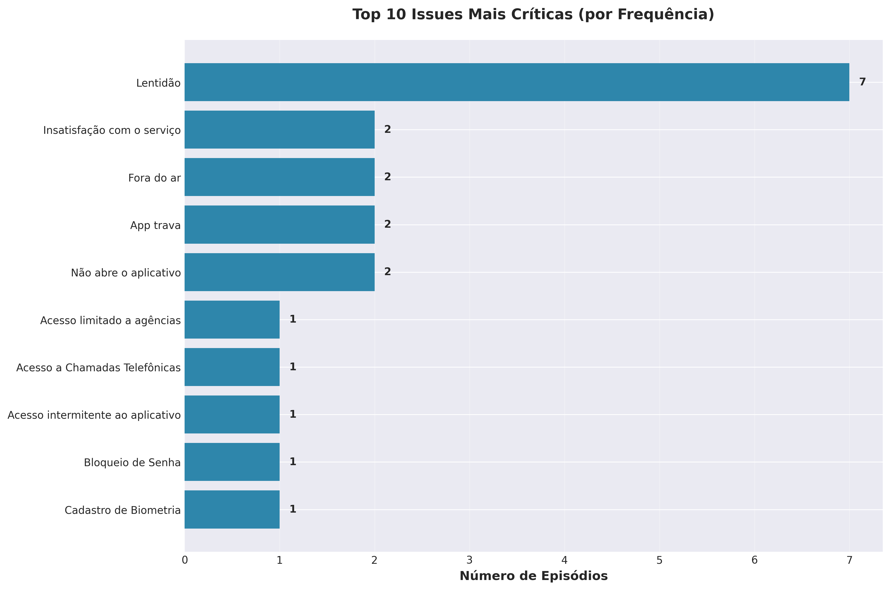
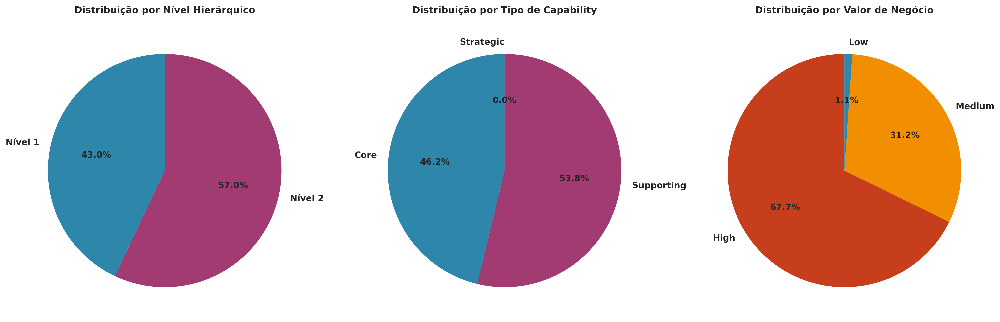
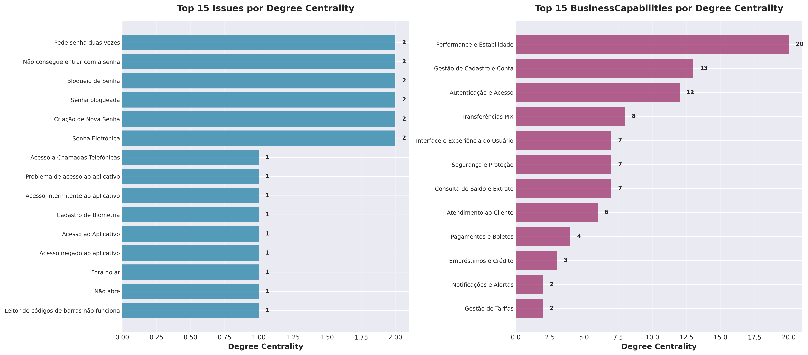
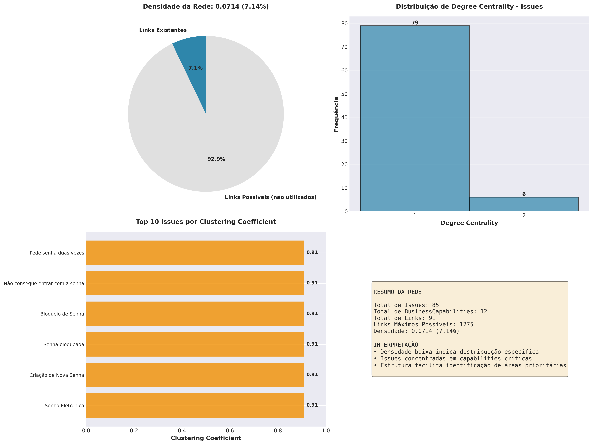

Trabalho de Conclusão de Curso apresentado para obtenção do título de especialista em __________ (Nome do curso) – ____ (ano da defesa)

---

# Priorização de Backlog em Apps Bancários via Knowledge Graph e Feedback do Usuário

Simone Rossetti Nobre Naxara¹\*; Dra. Anna Carolina Martins²

¹ Nome da Empresa ou Instituição (opcional). Titulação ou função ou departamento. Endereço completo (pessoal ou profissional) – Bairro; 00000-000 Cidade, Estado, País

² Técnica em Redes de computadores pelo Senac, Economista graduada pela Unimontes, Mestre em Economia Aplicada pela Universidade Federal de Ouro Preto (UFOP) e doutoranda em Economia na área de Teoria Econômica na Unicamp. São Paulo, SP, Brasil.

\*autor correspondente: simone-rossetti@usp.br

---

## Resumo

Aplicativos bancários enfrentam o desafio constante de manter qualidade em produção, onde falhas emergem de forma inesperada e escapam aos testes tradicionais. As lojas de aplicativos acumulam milhares de avaliações textuais que, embora ricas em informações, permanecem pouco exploradas pelas equipes de desenvolvimento. Este trabalho propõe uma solução que combina Knowledge Graph e técnicas de Inteligência Artificial para extrair automaticamente problemas técnicos dessas avaliações, conectá-los às capacidades de negócio afetadas e produzir documentos estruturados que orientam a priorização do backlog. A abordagem implementada utiliza uma arquitetura em dois estágios: modelos Transformer como BERTweet analisam a polaridade dos comentários, enquanto LLMs como GPT-4o extraem entidades que são modeladas em um grafo temporal no Neo4j. Ao processar avaliações reais do aplicativo CAIXA, observou-se que o sistema consegue estabelecer conexões consistentes entre problemas reportados e áreas funcionais do negócio. Destaca-se que aproximadamente um quinto das reclamações críticas concentra-se em questões de Performance e Estabilidade, evidenciando a capacidade da solução em transformar feedback não estruturado em informações práticas para equipes técnicas.

**Palavras-chave:** Testes de Qualidade; Mobile Banking; Análise de Polarização; Knowledge Graph; Priorização de Backlog; QA; Feedback do Usuário Final; NLP; LLM; Social Network Analysis.

---

## Introdução

O setor financeiro brasileiro viveu uma transformação profunda nas últimas décadas, com os aplicativos móveis assumindo o papel de principal interface entre bancos e clientes. Dados da FEBRABAN (2024) revelam que mais de três quartos das transações bancárias já ocorrem através de dispositivos móveis. Nesse cenário de dependência tecnológica crescente, a qualidade dos aplicativos torna-se questão estratégica. Quando problemas técnicos surgem, as consequências vão além da frustração do usuário: há perda de confiança, migração para concorrentes e prejuízos financeiros mensuráveis (Anouze et al., 2019).

Embora essenciais, os testes tradicionais definidos pelo ISTQB (2023) — que incluem testes unitários, de integração, de sistema e de aceitação — possuem limitações conhecidas. Eles não conseguem reproduzir a complexidade do ambiente real de produção, onde dispositivos diversos, conexões instáveis e comportamentos inesperados dos usuários criam cenários imprevisíveis. Em organizações que adotam deploy contínuo, novas versões são liberadas constantemente, e falhas introduzidas podem impactar milhares ou milhões de usuários antes que os mecanismos convencionais de monitoramento as identifiquem.

As lojas de aplicativos funcionam como verdadeiros termômetros da experiência do usuário em produção. Google Play e Apple Store recebem diariamente milhares de avaliações textuais que, em sua maioria, permanecem como dados não estruturados. Para profissionais de qualidade e desenvolvimento, essas avaliações representam uma oportunidade única: elas funcionam como uma extensão natural do User Acceptance Testing (ISTQB, 2023), porém em ambiente real de produção. O desafio está em transformar esse volume massivo de texto em informações acionáveis. Monitorar apenas as notas de 1 a 5 estrelas não basta — uma mesma avaliação negativa pode esconder problemas completamente distintos: lentidão no login, falha em transferências Pix ou cobrança indevida de tarifas, cada um demandando intervenção de equipes diferentes.

A literatura sobre análise de sentimentos em contexto financeiro ainda se concentra principalmente na classificação básica de polaridade — positivo, negativo ou neutro (Liu, 2012; Gupta et al., 2020). Por outro lado, pesquisas em Engenharia de Software têm demonstrado o potencial das avaliações de aplicativos como fonte de insights sobre problemas técnicos e funcionais (Guzman & Maalej, 2014; Pagano & Maalej, 2013). No contexto nacional, encontram-se contribuições importantes sobre qualidade em métodos ágeis (Oliveira, 2014), práticas de teste adotadas por empresas brasileiras (Nascimento, 2005) e modelos específicos para priorização de backlog bancário (Lima & Costa, 2024). Ainda assim, observa-se uma lacuna: poucas abordagens conseguem correlacionar problemas reportados com versões específicas do aplicativo e com as capacidades de negócio impactadas, muito menos gerar documentos estruturados de priorização a partir de dados reais de produção.

Identifica-se uma lacuna significativa no campo de testes de qualidade: faltam sistemas capazes de extrair automaticamente problemas técnicos dos comentários de usuários, associá-los às versões do aplicativo e às capacidades de negócio impactadas, e ainda identificar padrões que orientem a priorização do backlog. Essa necessidade torna-se ainda mais urgente quando consideramos o ritmo acelerado de deploy contínuo, onde múltiplas versões são liberadas em intervalos curtos. Nesse contexto, falhas introduzidas podem se espalhar rapidamente, afetando grandes volumes de usuários antes que os mecanismos tradicionais de monitoramento as capturem.

Este trabalho apresenta uma proposta para enfrentar essa lacuna, desenvolvendo uma abordagem de testes que opera além da esteira tradicional de desenvolvimento. A solução combina Knowledge Graph com técnicas avançadas de Processamento de Linguagem Natural para converter o feedback textual dos usuários em documentos estruturados que orientam a priorização do backlog. O sistema identifica bugs associados a versões específicas e os relaciona com as capacidades de negócio afetadas, criando uma ponte de comunicação entre equipes de qualidade, produto e desenvolvimento. A validação da metodologia utilizou dados reais do aplicativo móvel da Caixa Econômica Federal, demonstrando sua viabilidade prática no contexto bancário, embora seja aplicável a qualquer aplicativo bancário móvel.

Diferentemente de abordagens que se limitam à análise de polaridade, esta proposta incorpora técnicas de Named Entity Recognition para extrair problemas específicos dos comentários e utiliza uma modelagem própria de Knowledge Graph temporal que captura relacionamentos complexos entre entidades. A aplicação de Knowledge Graphs na análise de feedback de usuários ainda é uma área em desenvolvimento, mas trabalhos recentes já demonstram sua eficácia em revelar padrões e correlações que não seriam evidentes através de análises tradicionais (Chen et al., 2022; Hogan et al., 2021). Além disso, a aplicação de métricas de Social Network Analysis ao grafo permite identificar padrões estruturais e nós influentes na rede de problemas, seguindo metodologias consolidadas por Pinheiro (2011) e Newman (2010), adicionando uma dimensão analítica que enriquece a abordagem quantitativa convencional.

O foco da abordagem está na análise de dados recentes coletados diretamente em produção, permitindo que equipes de qualidade identifiquem problemas de forma proativa e produzam documentos de priorização que orientem tanto a correção de bugs quanto a melhoria contínua dos aplicativos. A capacidade de identificar bugs por versão através de consultas no grafo e gerar documentos estruturados automaticamente representa um avanço considerável quando comparada às abordagens tradicionais, que dependem de análise manual de logs, tickets e avaliações não estruturadas.

---

## Material e Métodos

Esta pesquisa caracteriza-se como aplicada e quantitativa, com o objetivo de desenvolver uma abordagem para testes de qualidade que opere além da esteira tradicional de desenvolvimento. O foco está na identificação de bugs associados a versões específicas e na geração de documentos que orientem a priorização do backlog em produtos bancários móveis. A metodologia foi organizada em seis etapas principais que se sucedem: inicialmente coletam-se os dados, em seguida analisa-se a polarização dos comentários, extraem-se as entidades relevantes, modela-se o Knowledge Graph, aplicam-se métricas de Social Network Analysis e, por fim, geram-se os documentos de priorização. A abordagem dialoga com pesquisas sobre qualidade de software em contextos ágeis (Oliveira, 2014) e com práticas de teste observadas em empresas brasileiras (Nascimento, 2005), adaptando esses conceitos para o cenário específico de aplicativos bancários móveis. A incorporação de técnicas de Social Network Analysis (Pinheiro, 2011; Newman, 2010) permite uma análise estrutural do Knowledge Graph que vai além da contagem simples, revelando padrões e nós influentes na rede de problemas identificados.

### Arquitetura híbrida de modelagem

O desafio de equilibrar custos computacionais com precisão semântica levou ao desenvolvimento de uma arquitetura híbrida dividida em dois estágios distintos. Cada estágio emprega técnicas de Processamento de Linguagem Natural escolhidas especificamente para sua função. A Figura 1 apresenta o fluxo completo, desde a coleta inicial dos dados até a produção final dos documentos de priorização.



**Figura 1**: Pipeline de processamento de avaliações, desde a coleta até a geração de documentos de priorização. Fonte: Elaboração própria (2026).

A arquitetura proposta distancia-se das abordagens tradicionais de Retrieval-Augmented Generation (RAG), que tratam a informação de forma estática. Em vez disso, implementa-se um Knowledge Graph temporal que compreende o conhecimento como fatos que se transformam ao longo do tempo (Fan et al., 2024). Essa perspectiva temporal possibilita acompanhar como os problemas reportados mudam entre diferentes versões do aplicativo, o que facilita tanto a identificação de regressões quanto a observação de padrões que se desenvolvem temporalmente.

A divisão em dois estágios segue uma lógica de otimização: o primeiro utiliza modelos Transformer pré-treinados para classificar a polarização dos comentários, enquanto o segundo recorre a Large Language Models para realizar a extração estruturada de entidades e construir o Knowledge Graph. Essa estratégia reduz custos computacionais ao processar apenas comentários negativos — identificados no primeiro estágio — com os modelos mais dispendiosos no segundo estágio. Além disso, a especialização de cada modelo em sua função específica contribui para maior precisão nos resultados.

### Coleta e definição do dataset

O conjunto de dados utilizado neste trabalho foi formado por avaliações públicas coletadas da Google Play Store, especificamente do aplicativo CAIXA da Caixa Econômica Federal. A coleta foi automatizada através de um script desenvolvido em Python, utilizando a biblioteca `google-play-scraper` e o identificador `br.com.gabba.Caixa`.

As avaliações foram obtidas da Google Play Store com script automatizado (`google-play-scraper`), com filtro por data conforme a execução da coleta. O conjunto utilizado neste trabalho reúne **2.451** avaliações com datas entre **5 e 18 de janeiro de 2026**. Para cada registro foram considerados o texto, a nota (1 a 5), a data e a versão do aplicativo. A nota entrou apenas no cálculo de severidade na priorização; a polaridade para validação do modelo segue o descrito na seção Validação e *ground truth*.

Com base na média observada nesse arquivo (**2.451** avaliações ÷ **~13** dias ≈ **188** por dia), extrapola-se **~1.300** avaliações em 7 dias e **~5.600** em 30 dias — ordens de grandeza indicativas, sujeitas a variação sazonal e a picos de versão. Na higienização inicial removeram-se comentários vazios ou com menos de três palavras. Por que três palavras? Liu (2012) e Guzman e Maalej (2014) mostram que a densidade semântica mínima para análise de sentimento exige um pouco mais que uma palavra isolada. Avaliações como "Péssimo" ou "Ruim" não trazem contexto suficiente — não dá para saber se o usuário reclamou de lentidão, de falha no PIX ou de cobrança indevida. Guzman e Maalej (2014) e Pagano e Maalej (2013) apontam ainda que textos muito curtos costumam ser ambíguos e pouco úteis para extração de domínio. Com a filtragem, só seguem para análise registros com conteúdo aproveitável, o que melhora a qualidade do dataset e reduz ruído.

Na fase de validação preliminar, coletaram-se avaliações em uma janela temporal específica. O modelo BERTweet foi utilizado para classificar as avaliações quanto à polaridade. Em seguida, aplicou-se um filtro automático que eliminou comentários genéricos sem informação útil antes do processamento completo. Para esta análise inicial, selecionaram-se comentários negativos considerados representativos, que foram processados integralmente com o modelo GPT-4o. Os resultados quantitativos dessa coleta e processamento são apresentados na seção de Resultados e Discussões.

### Validação e *ground truth*

Para assegurar a confiabilidade dos resultados, optou-se por não utilizar a nota atribuída pelo usuário como verdade absoluta. Construiu-se então um dataset de referência (Ground Truth) que passou por um processo de dupla anotação cega, realizada por dois avaliadores independentes. O nível de concordância entre os anotadores foi mensurado através do coeficiente Kappa de Cohen (Fávero & Belfiore, 2024). A escolha da arquitetura Transformer resultou de um estudo comparativo empírico que avaliou o DistilBERT Multilíngue e o BERTweet (XLM-RoBERTa), utilizando um conjunto de 1.000 avaliações previamente validadas manualmente. Os resultados dessa comparação encontram-se detalhados na seção de Resultados e Discussões.

Uma decisão importante no pré-processamento foi preservar a estrutura sintática original dos comentários, contrariando práticas tradicionais que removem massivamente stop words. Essa escolha fundamenta-se no fato de que modelos Transformer dependem de mecanismos de atenção para interpretar o contexto completo. Como destacam Devlin et al. (2019), a remoção excessiva de palavras pode eliminar nuances importantes, particularmente em construções com negações. Portanto, o pré-processamento limitou-se à remoção de caracteres não textuais e à anonimização de dados pessoais, seguindo as diretrizes da LGPD.

No primeiro estágio, cada comentário é classificado pelo modelo XLM-RoBERTa (cardiffnlp/twitter-xlm-roberta-base-sentiment), pré-treinado com 198 milhões de tweets e ajustado para linguagem informal típica de avaliações brasileiras (Liu, 2012). Adotaram-se os parâmetros padrão do Hugging Face Transformers, sem fine-tuning — uma única passada forward basta para obter a classificação em positivo, negativo ou neutro, a partir da distribuição de probabilidades. Essa etapa atua como filtro: só os negativos seguem para o estágio seguinte. Antes disso, um sistema de triagem descarta comentários genéricos sem informação útil (por exemplo, só "Péssimo" ou "Horrível"), o que melhora o grafo final e corta custo de processamento.

O segundo estágio trabalha só com os comentários negativos. O GPT-4o faz a extração de entidades com técnicas de Named Entity Recognition adaptadas ao domínio. Adotou-se temperatura 0.1 para dar mais consistência e determinismo, com resposta em JSON estruturado para facilitar o parsing. A Few-Shot Learning entrega exemplos que guiam o modelo na tarefa e, conforme Fulford e Ng (2023), supera Topic Modeling ao lidar com ambiguidades e contexto implícito sem treino extensivo. O fluxo tem cinco etapas: extração inicial; reflexão (recupera o que passou batido na primeira leitura, sobretudo entidades implícitas ou em pronomes); filtragem de entidades genéricas ou fora do escopo do app; mapeamento para BusinessCapabilities via algoritmo híbrido; e modelagem temporal no Neo4j.

A etapa de reflexão é um diferencial da arquitetura. Depois da extração inicial, uma segunda chamada ao GPT-4o (também com temperatura 0.1) pede ao modelo que revise o comentário e compare com o que já foi extraído. O prompt orienta a buscar entidades implícitas, referências por pronomes, pressupostos não declarados e problemas mencionados de forma indireta. Com essa segunda passada, é possível recuperar algo entre 5% e 10% de entidades que uma abordagem em passada única deixaria escapar, sobretudo em comentários mais indiretos. Os resultados dessa etapa aparecem na seção de Resultados e Discussões.

As entidades identificadas são organizadas em cinco tipos predefinidos: Issue (para problemas técnicos ou funcionais), App, Version, Service e Device. A arquitetura implementada compreende o conhecimento como fatos que se transformam ao longo do tempo, diferenciando-se de sistemas RAG convencionais que tratam a informação de forma estática (Fan et al., 2024). A estrutura é composta por três subgrafos que se interconectam: o Subgrafo Episódico mantém o conteúdo original bruto dos comentários, funcionando como uma espécie de memória episódica que preserva o contexto completo, com unicidade garantida através de hash MD5; o Subgrafo Semântico armazena as entidades conectadas por fatos que possuem metadados bi-temporais, registrando quando cada fato era válido no mundo real, o que possibilita consultas históricas e a identificação de regressões; e o Subgrafo de Comunidade agrupa entidades que apresentam conexões fortes através de técnicas de Label Propagation. A escolha do Neo4j como banco de dados fundamentou-se em sua capacidade nativa de modelar relacionamentos complexos e em sua eficiência ao executar consultas sofisticadas em grafos (Robinson et al., 2015).

### BusinessCapability e modelagem de domínio

As BusinessCapabilities representam capacidades de negócio organizadas hierarquicamente em três níveis, agrupando funcionalidades relacionadas conforme o modelo estabelecido por Ulrich e Rosen (2011) em "The Business Capability Map". Cada capacidade é caracterizada por quatro dimensões principais: seu nível hierárquico (1 para capacidades Core, 2 para Específicas, 3 para Detalhadas), seu tipo segundo a classificação TOGAF (Core, Supporting ou Strategic), seu nível de maturidade conforme o modelo CMMI (Initial, Managed, Defined ou Optimized), e seu valor de negócio (High, Medium ou Low), determinado pelo impacto direto na experiência do usuário e na receita.

A partir de uma análise detalhada do domínio e das funcionalidades típicas de aplicativos bancários móveis, foram identificadas e mapeadas 15 capacidades distintas. Entre as capacidades de nível 1 encontram-se Autenticação e Acesso, Performance e Estabilidade, Interface e Experiência do Usuário, e Segurança e Proteção. No nível 2, destacam-se Transferências PIX, Empréstimos e Crédito, Pagamentos e Boletos, Consulta de Saldo e Extrato, Atendimento ao Cliente, Gestão de Cadastro e Conta, Investimentos, Notificações e Alertas, Gestão de Tarifas e Acesso Geográfico. Por fim, no nível 3, foi incluída a categoria Outras Funcionalidades para capturar itens que não se enquadram adequadamente nas demais capacidades. Essa estrutura foi projetada para ser aplicável a qualquer aplicativo bancário móvel, não se limitando ao caso específico estudado.

Ao modelar BusinessCapabilities como entidades no grafo, cria-se uma ponte semântica que conecta o feedback textual dos usuários à estrutura organizacional do desenvolvimento. Quando uma issue é associada a uma BusinessCapability, o sistema vai além da simples identificação do problema técnico — ele também sinaliza qual capacidade de negócio foi impactada. Essa conexão facilita significativamente a comunicação entre equipes de produto, desenvolvimento e negócio, pois traduz problemas técnicos em termos que fazem sentido para diferentes stakeholders. A abordagem encontra ressonância nos princípios de Domain-Driven Design (Evans, 2003), onde o modelo de domínio deve espelhar a estrutura real do negócio.

### Arquitetura do grafo e análise de redes sociais

A estrutura do grafo foi cuidadosamente projetada com dois objetivos principais: garantir a unicidade das entidades e facilitar a identificação de bugs associados a versões específicas. Essa modelagem segue princípios estabelecidos para análise de software através de grafos (Coskun et al., 2021). A escolha por um Knowledge Graph abre a possibilidade de aplicar técnicas de Social Network Analysis, que permitem identificar padrões estruturais, nós influentes e comunidades de problemas relacionados, seguindo metodologias consolidadas por Pinheiro (2011) e Newman (2010). O Quadro 1 apresenta a estrutura completa do Knowledge Graph Temporal implementado.

**Quadro 1**: Estrutura do Knowledge Graph Temporal

```
App (CAIXA) ← único
  ↑ BELONGS_TO
Version (versão do app) ← agrupa episódios
  ↑ HAS_VERSION
Episode (comentário original preservado)
  ↓ CONTAINS_ENTITY
Issue (ex: "Lentidão", "PIX não funciona")
  ↓ RELATED_TO_VERSION (com propriedade count)
Version
  ↓ RELATES_TO_CAPABILITY
BusinessCapability (ex: "Performance e Estabilidade")
```

Fonte: Elaboração própria (2026).

A estrutura apresenta cinco características principais que merecem destaque. Primeiro, o aplicativo é representado por uma única entidade, evitando duplicações e mantendo a integridade referencial. Segundo, cada versão do aplicativo constitui uma entidade separada que agrupa episódios relacionados, o que possibilita identificar problemas específicos de determinadas versões. Terceiro, entidades que compartilham o mesmo nome são automaticamente agrupadas, seguindo o princípio de Entity Resolution (Christen, 2012). Quarto, o relacionamento `RELATED_TO_VERSION` incorpora uma propriedade `count` que se incrementa a cada nova ocorrência, permitindo visualização proporcional e identificação rápida de versões que apresentam mais problemas. Por fim, o sistema permite que entidades sejam relacionadas a múltiplas BusinessCapabilities quando isso faz sentido — por exemplo, "Mudança de Senha" pode estar associada tanto a Login/Autenticação quanto a Segurança.

### Mapeamento entidade → BusinessCapability

O mapeamento de entidades para BusinessCapabilities ocorre através de um algoritmo híbrido que combina regras baseadas em conhecimento de domínio com inferência semântica. O processo inicia com um mapeamento direto que utiliza um dicionário extenso contendo mais de 200 palavras-chave, construído a partir de análise de domínio e validação manual. Esse dicionário foi projetado para priorizar correspondências mais específicas — por exemplo, "não reconhece biometria" tem precedência sobre simplesmente "biometria". O sistema também suporta mapeamento multi-capability, permitindo que algumas entidades sejam associadas a múltiplas BusinessCapabilities quando isso reflete a realidade do problema, como no caso de "Mudança de Senha" que pode estar relacionada tanto a Login/Autenticação quanto a Segurança.

Para lidar com ambiguidades, o algoritmo realiza uma análise de contexto que considera o conteúdo completo do comentário. Isso permite distinguir casos como "Problemas de Abertura", que podem referir-se a performance do aplicativo ou a questões de cadastro de conta bancária, dependendo do contexto. Como mecanismo de fallback, o sistema verifica palavras-chave específicas antes de recorrer a uma categoria padrão, dando prioridade a áreas como Interface/Usabilidade, Empréstimos/Crédito, Atendimento e Segurança. Por fim, uma validação pré-criação garante que entidades só sejam inseridas no grafo se puderem ser mapeadas para pelo menos uma BusinessCapability, o que assegura alta cobertura de linkagem — excluindo apenas a categoria "Outras Funcionalidades", que serve como receptáculo para itens que não se enquadram adequadamente nas demais capacidades.

A combinação entre regras baseadas em conhecimento e inferência semântica oferece tanto eficiência quanto flexibilidade, alinhando-se com recomendações de Hovy et al. (2013) sobre sistemas híbridos de classificação de texto. O processo de refinamento do algoritmo envolveu validação manual de 20 comentários, seguindo uma abordagem de refinamento iterativo fundamentada em validação manual que encontra respaldo em práticas de melhoria contínua de processos de qualidade (Brogini, 2018), onde ajustes incrementais são essenciais para a evolução constante do processo.

Na fase de seleção do modelo, foram avaliados quatro modelos GPT diferentes para a tarefa de extração de entidades e mapeamento para BusinessCapabilities, utilizando um conjunto de 20 comentários validados manualmente. Os resultados dessa comparação são apresentados na seção de Resultados e Discussões.

### Métricas de Social Network Analysis (SNA)

A estrutura do Knowledge Graph possibilita a aplicação de métricas de Social Network Analysis que revelam padrões estruturais e identificam nós influentes na rede formada por issues e BusinessCapabilities (Pinheiro, 2011; Newman, 2010). Quatro métricas principais foram calculadas através de queries Cypher executadas no Neo4j: Degree Centrality, que conta o número de conexões diretas de cada nó; Betweenness Centrality, que identifica nós que funcionam como "pontes" conectando diferentes partes da rede; Closeness Centrality, que mede a proximidade média de um nó em relação aos demais; e Clustering Coefficient, que calcula a proporção de conexões existentes entre vizinhos de um nó em relação ao número máximo possível de conexões, variando de 0 a 1 conforme a definição de Newman (2010). Os resultados da aplicação dessas métricas são apresentados e discutidos na seção de Resultados e Discussões.

### Métricas e validação do modelo

A validação do modelo seguiu as recomendações estatísticas estabelecidas por Fávero e Belfiore (2024) para modelos de classificação. Separou-se um subconjunto de controle que foi rotulado manualmente por especialistas humanos, funcionando como Gold Standard. O desempenho foi avaliado através de cinco métricas principais, seguindo práticas consolidadas em estudos sobre garantia de qualidade de software (Nascimento, 2005; Matos, 2014).

A acurácia representa o percentual global de acertos do modelo, calculado dividindo-se o número de predições corretas pelo total de predições realizadas. No contexto deste trabalho, essa métrica reflete a capacidade do modelo em classificar corretamente a polarização dos comentários ou em mapear entidades para BusinessCapabilities. A precisão, por sua vez, mede a proporção de predições positivas que realmente correspondem à realidade. Quando a precisão é alta, há maior confiança de que as classificações ou mapeamentos estão corretos, minimizando falsos positivos. O recall (ou revocação) avalia a proporção de casos positivos reais que foram corretamente identificados pelo modelo. Um recall alto indica que o modelo não está deixando passar muitos casos importantes, aspecto especialmente relevante quando o objetivo é identificar problemas críticos em produção sem gerar falsos negativos. O F1-Score funciona como uma média harmônica entre precisão e recall, equilibrando ambas as métricas e sendo particularmente útil para validar o desempenho em categorias desbalanceadas — como quando há muitas reclamações sobre "Login" mas poucas sobre "Investimentos". Por fim, o ROC AUC (Area Under the ROC Curve) mede a capacidade geral do modelo em distinguir entre diferentes classes, variando de 0 a 1, onde 1 representa classificação perfeita e 0.5 equivale ao desempenho de um classificador aleatório.

Para validar especificamente a extração de entidades e a modelagem em grafo, estabeleceram-se três métricas adicionais. A cobertura de linkagem mensura o percentual de entidades que foram conectadas com sucesso a pelo menos uma BusinessCapability. A taxa de identificação de bugs por versão avalia a capacidade do sistema em identificar versões problemáticas através de consultas no grafo. Por fim, a precisão do mapeamento entidade → BusinessCapability foi validada através de avaliação realizada por especialistas de domínio.

### Metodologia de testes de qualidade além da esteira

A abordagem proposta situa-se no contexto de testes de qualidade que operam além do final da esteira tradicional de desenvolvimento, funcionando como complemento aos testes executados durante o ciclo de desenvolvimento — testes unitários, de integração, de sistema e de aceitação, conforme definido pelo ISTQB Foundation Level (ISTQB, 2023). Essa metodologia encontra ressonância no conceito de "Testing in Production" (Kaplan & Bailey, 2016) e nas práticas de testes ágeis (ISTQB, 2023), onde o feedback do usuário final coletado em ambiente de produção real é aproveitado como uma forma complementar de validação de qualidade.

A integração com processos de QA tradicionais segue uma lógica de complementaridade: a abordagem proposta não substitui os testes tradicionais, mas os complementa ao capturar problemas que emergem em produção devido a fatores que não são reproduzíveis em ambientes controlados. Entre esses fatores destacam-se a diversidade de dispositivos e versões de sistema operacional, condições de rede variáveis (3G, 4G, 5G, Wi-Fi), padrões de uso não previstos pelos casos de teste, interações complexas entre funcionalidades que não foram testadas em conjunto, e problemas específicos de versão que são introduzidos em contextos de deploy contínuo.

A geração de documentos de priorização de backlog aproveita a estrutura do Knowledge Graph construído para produzir documentos estruturados que incluem uma lista de issues identificadas em produção, ordenadas por criticidade (calculada como frequência multiplicada por severidade), correlação entre issues e versões específicas do aplicativo, mapeamento de issues para BusinessCapabilities afetadas, distribuição de problemas por capacidade de negócio, e identificação de versões problemáticas que requerem atenção imediata.

Esta metodologia facilita a comunicação entre equipes de qualidade, produto e desenvolvimento, fornecendo dados estruturados que orientam a priorização de correções e melhorias baseada em feedback real de usuários em produção, conforme recomendado por Crisman et al. (2019) sobre técnicas de priorização de dívida técnica e problemas de qualidade. A abordagem de priorização de backlog proposta alinha-se com modelos desenvolvidos especificamente para o setor bancário (Lima & Costa, 2024), adaptando técnicas de priorização para o contexto de aplicativos móveis financeiros.

---

## Resultados e Discussões

### Amostra processada

Na fase de validação preliminar, coletaram-se 2.451 avaliações entre os dias 5 e 18 de janeiro de 2026. O modelo BERTweet classificou 878 dessas avaliações como negativas, representando 35.82% do total. Em seguida, aplicou-se um filtro automático que eliminou 115 comentários genéricos sem informação útil — cerca de 13.1% dos comentários negativos — resultando em 763 comentários válidos. Para esta análise inicial, selecionaram-se 100 comentários negativos considerados representativos, que foram processados integralmente com o modelo GPT-4o.

### Comparação de modelos GPT para extração de entidades

Para a tarefa de extração de entidades e mapeamento para BusinessCapabilities, foram avaliados quatro modelos GPT diferentes utilizando um conjunto de 20 comentários validados manualmente. A Figura 2 apresenta os resultados comparativos de acurácia obtidos nessa avaliação.



**Figura 2**: Comparação de modelos GPT para extração de entidades e mapeamento para BusinessCapability. (A) Comparação de acurácia, (B) Distribuição de resultados (Corretos, Incorretos, Não Encontrados). Fonte: Validação manual com 22 mapeamentos (2026).

A análise dos resultados apresentados na Figura 2 revela que o modelo GPT-4o-2024-08-06 destacou-se pela melhor relação custo-benefício entre os modelos avaliados, alcançando 63.6% de acurácia — equivalente a 14 mapeamentos corretos em 22 tentativas. Esse desempenho foi observado após o refinamento do algoritmo de mapeamento, que resultou em uma melhoria significativa em relação à acurácia inicial de 54.5%. A distribuição de resultados mostrada no painel (B) da Figura 2 indica que, embora nenhum modelo tenha alcançado perfeição na tarefa, o GPT-4o-2024-08-06 apresentou o melhor equilíbrio entre mapeamentos corretos e incorretos, com menor número de casos não encontrados. Esses resultados justificaram a escolha desse modelo como padrão para o pipeline de produção, considerando tanto a precisão quanto os custos computacionais envolvidos. Na rotina de produto, esses 63,6% já permitem encaminhar boa parte das reclamações à capacidade de negócio certa sem ler avaliação por avaliação — o que alivia o time e dá base para priorizar o backlog, ainda que o mapeamento mereça evoluir com o tempo.

Ao olhar de perto os 8 mapeamentos incorretos da Figura 2, aparecem alguns padrões claros. Em parte, o modelo tropeça em gírias e expressões regionais do contexto bancário brasileiro que não entraram nos exemplos de Few-Shot. Sarcasmo e ironia também confundem — quando o texto inverte o sentido literal, a funcionalidade afetada sai errada. Outro caso típico: comentários que citam vários problemas em poucas linhas; aí o modelo escolhe uma funcionalidade e ignora outra. Por fim, referências implícitas (que dependem de contexto cultural ou domínio) costumam passar despercebidas. São limitações conhecidas em NLP para domínios específicos e dão sentido ao refinamento iterativo do algoritmo realizado ao longo do trabalho.

### Comparação de modelos de polarização

A escolha da arquitetura Transformer resultou de um estudo comparativo empírico que avaliou dois modelos pré-treinados: o DistilBERT Multilíngue e o BERTweet (XLM-RoBERTa). A comparação utilizou um conjunto de 1.000 avaliações que foram validadas manualmente, servindo como Ground Truth. As Figuras 3 e 4 apresentam os resultados detalhados dessa comparação.



**Figura 3**: Comparação de métricas entre DistilBERT Multilíngue e BERTweet para análise de polarização do comentário. (A) Curva ROC, (B) Comparação de métricas (ROC AUC, Precision, Recall, F1-Score), (C) Comparação de acurácia. Fonte: Dados processados com Ground Truth de 1.000 avaliações (2025).



**Figura 4**: Matrizes de confusão comparativas entre DistilBERT Multilíngue (esquerda) e BERTweet (direita) para classificação de polarização do comentário (positivo, negativo, neutro). Fonte: Dados processados com Ground Truth de 1.000 avaliações (2025).

Os resultados apresentados na Figura 3 revelam uma superioridade estatística clara do modelo BERTweet na tarefa de classificação de polarização de comentários bancários. Enquanto o DistilBERT alcançou 74.32% de acurácia, o BERTweet atingiu 96.17%. A diferença é ainda mais pronunciada quando observamos o ROC AUC: 78.98% para o DistilBERT contra 98.97% para o BERTweet. O F1-Score também favorece o BERTweet com 96.92%, comparado aos 75.26% do DistilBERT. A análise das matrizes de confusão na Figura 4 mostra que o BERTweet produziu significativamente menos falsos positivos e falsos negativos, especialmente ao classificar comentários negativos. Uma observação interessante é que o BERTweet demonstrou maior capacidade de interpretar ironias e expressões típicas do setor bancário brasileiro — como identificar "app rodando liso" como positivo ou "o app só engasga" como negativo. Esses resultados justificaram a escolha do BERTweet como modelo padrão para o pipeline de produção. A acurácia de 96,17% significa, para quem cuida do produto, que a separação automática de comentários negativos costuma coincidir com o que um avaliador marcaria na mão — menos retrabalho e menos risco de puxar demanda para a fila errada por causa de polaridade mal lida. Já o ROC AUC de 98,97% mostra que o modelo ainda separa bem as classes quando o texto é enrolado ou ambíguo; na prática, isso pesa a favor de não deixar escapar reclamação séria nem gastar energia com falso alarme na hora de decidir o que segue para extração de entidades e para o backlog.

### Estatísticas do grafo

O processamento completo utilizando o modelo GPT-4o-2024-08-06 resultou em um grafo com as seguintes características:

**Tabela 1**: Estatísticas do Knowledge Graph

| Métrica | Quantidade |
|:---|:---|
| Episódios (comentários processados) | 103 |
| Entidades extraídas (Issues) | 85 |
| BusinessCapability | 15 |
| Relacionamentos Issue ↔ BusinessCapability | 91 |

Fonte: Resultados originais da pesquisa (2026).

Os números apresentados na Tabela 1 oferecem uma visão interessante sobre a eficácia do processamento. Dos 100 comentários negativos selecionados, foram processados 103 episódios únicos (alguns comentários geraram múltiplos episódios devido à extração de múltiplas entidades). A extração identificou 85 issues distintas, o que sugere que o sistema conseguiu reconhecer problemas diferentes mesmo quando apareciam em contextos variados. 

Chama a atenção o fato de os relacionamentos (91) serem mais numerosos que as issues (85). Isso significa que boa parte das issues foi associada a mais de uma BusinessCapability — o grafo está capturando o caráter transversal dos problemas bancários. "Bloqueio de Senha", por exemplo, liga ao mesmo tempo "Autenticação e Acesso" e "Segurança e Proteção": em app bancário, falhas de autenticação têm repercussão tanto funcional quanto de segurança. Ver o problema por mais de um ângulo ajuda na priorização, porque equipes de desenvolvimento, segurança e produto conseguem enxergar o impacto completo. As issues se distribuem por 15 BusinessCapabilities, sem concentração exagerada em poucas áreas.

### Cobertura de linkagem

A cobertura de linkagem entre entidades e BusinessCapabilities constitui uma métrica fundamental para avaliar a qualidade do processamento. Das 85 Issues identificadas, estabeleceram-se 91 relacionamentos com BusinessCapabilities — o que indica que algumas issues estão associadas a múltiplas capabilities. Importante destacar que a taxa de cobertura foi calculada excluindo a categoria "Outras Funcionalidades", que serve como receptáculo para itens que não se enquadram adequadamente nas capacidades de negócio definidas. Essa exclusão garante que apenas mapeamentos válidos sejam considerados na métrica.

A alta taxa de cobertura observada resultou de três estratégias combinadas. Primeiro, um mapeamento direto refinado que incorpora mais de 200 palavras-chave cuidadosamente selecionadas. Segundo, uma verificação por palavras-chave que ocorre antes de recorrer a uma categoria padrão. Terceiro, uma validação pré-criação que impede que entidades sejam criadas no grafo sem um mapeamento válido para pelo menos uma BusinessCapability.

### Distribuição de issues por BusinessCapability

A forma como as issues se distribuem entre as diferentes BusinessCapabilities oferece insights valiosos sobre a capacidade do sistema em identificar padrões de forma equilibrada. A Figura 5 apresenta essa distribuição visualmente, enquanto a Tabela 2 detalha os números específicos.



**Figura 5**: Distribuição de Issues e Episódios por BusinessCapability. Fonte: Resultados originais da pesquisa (2026).

**Tabela 2**: Distribuição de Issues por BusinessCapability

| BusinessCapability | Quantidade de Issues | % do Total |
|:---|:---|:---|
| Performance e Estabilidade | 20 | 23.53% |
| Gestão de Cadastro e Conta | 13 | 15.29% |
| Autenticação e Acesso | 12 | 14.12% |
| Transferências PIX | 8 | 9.41% |
| Interface e Experiência do Usuário | 7 | 8.24% |
| Segurança e Proteção | 7 | 8.24% |
| Consulta de Saldo e Extrato | 7 | 8.24% |
| Atendimento ao Cliente | 6 | 7.06% |
| Pagamentos e Boletos | 4 | 4.71% |
| Empréstimos e Crédito | 3 | 3.53% |
| Notificações e Alertas | 2 | 2.35% |
| Gestão de Tarifas | 2 | 2.35% |

Fonte: Resultados originais da pesquisa (2026).

A análise da distribuição revela um equilíbrio interessante entre as diferentes BusinessCapabilities. Destaca-se que "Performance e Estabilidade" concentra 23.53% das issues identificadas (20 de 85), agrupando problemas técnicos críticos como lentidão, travamentos, indisponibilidade e falhas na abertura do aplicativo. Essa concentração não surpreende, considerando que problemas de performance são frequentemente os mais visíveis e impactantes para os usuários.

As demais BusinessCapabilities apresentam distribuições mais equilibradas. Gestão de Cadastro e Conta responde por 15.29% das issues, principalmente relacionadas a dificuldades de acesso à conta e processos de cadastro. Autenticação e Acesso aparece com 14.12%, concentrando problemas de login, biometria e acesso geral ao aplicativo. Transferências PIX representa 9.41%, incluindo questões relacionadas a transferências, devoluções e gestão de chaves. Interface e Experiência do Usuário, Segurança e Proteção, e Consulta de Saldo e Extrato aparecem cada uma com 8.24%, refletindo preocupações com usabilidade, segurança de dados e visualização de informações financeiras. Atendimento ao Cliente concentra 7.06% das issues, relacionadas a suporte, chat e atendimento telefônico. Pagamentos e Boletos aparece com 4.71%, enquanto Empréstimos e Crédito representa 3.53% das issues identificadas.

### Top 10 issues mais críticas

Ao analisar o Knowledge Graph, foi possível identificar quais problemas foram mais frequentemente mencionados pelos usuários. A Figura 6 oferece uma visualização dessa distribuição, enquanto a Tabela 3 detalha as 10 issues mais críticas, organizadas por frequência de ocorrência e acompanhadas das BusinessCapabilities que foram impactadas.



**Figura 6**: Top 10 Issues Mais Críticas identificadas nos comentários, ordenadas por frequência de ocorrência. Fonte: Resultados originais da pesquisa (2026).

**Tabela 3**: Top 10 Issues Mais Críticas e suas BusinessCapabilities associadas

| Posição | Issue | Episódios | BusinessCapability |
|:---:|:---|:---:|:---|
| 1 | Lentidão | 7 | Performance e Estabilidade |
| 2 | App trava | 2 | Performance e Estabilidade |
| 3 | Bloqueio de Senha | 2 | Autenticação e Acesso / Segurança e Proteção |
| 4 | Criação de Nova Senha | 2 | Autenticação e Acesso / Segurança e Proteção |
| 5 | Fora do ar | 2 | Performance e Estabilidade |
| 6 | Insatisfação com o serviço | 2 | Interface e Experiência do Usuário |
| 7 | Não abre o aplicativo | 2 | Performance e Estabilidade |
| 8 | Não consegue entrar com a senha | 2 | Autenticação e Acesso / Segurança e Proteção |
| 9 | Pede senha duas vezes | 2 | Autenticação e Acesso / Segurança e Proteção |
| 10 | Senha Eletrônica | 2 | Autenticação e Acesso / Segurança e Proteção |

Fonte: Resultados originais da pesquisa (2026).

Os resultados revelam que a issue "Lentidão" destaca-se de forma significativa, aparecendo em 7 episódios diferentes e representando claramente o problema mais crítico identificado pelos usuários. As demais issues na lista apresentam frequência de 2 episódios cada, criando um segundo grupo de problemas que também merecem atenção. Observa-se que várias dessas issues estão relacionadas a Performance e Estabilidade, enquanto outras concentram-se em questões de Autenticação e Acesso, muitas vezes aparecendo em conjunto com Segurança e Proteção. Essa distribuição corrobora os padrões já identificados anteriormente, onde Performance e Estabilidade concentra 23.53% de todas as issues identificadas (20 de 85).

### Distribuição por nível e tipo de capability

Ao examinar como as issues se distribuem segundo as características das BusinessCapabilities, emergem padrões reveladores sobre a natureza dos problemas que os usuários reportam. A Figura 7 consolida essas informações visualmente, enquanto as Tabelas 4, 5 e 6 detalham os dados quantitativos organizados por nível hierárquico, tipo e valor de negócio, respectivamente.



**Figura 7**: Distribuição de Issues por Nível Hierárquico, Tipo de Capability e Valor de Negócio. Fonte: Resultados originais da pesquisa (2026).

**Tabela 4**: Distribuição de Issues por Nível Hierárquico das BusinessCapabilities

| Nível | Descrição | Issues | % Issues | Episódios | % Episódios |
|:---:|:---|:---:|:---:|:---:|:---:|
| 1 | Core (Capacidades fundamentais) | 32 | 37.65% | 50 | 48.54% |
| 2 | Específicas (Funcionalidades detalhadas) | 53 | 62.35% | 53 | 51.46% |
| **Total** | | **85** | **100%** | **103** | **100%** |

Fonte: Resultados originais da pesquisa (2026).

**Tabela 5**: Distribuição de Issues por Tipo de BusinessCapability

| Tipo | Descrição | Issues | % Issues | Episódios | % Episódios |
|:---:|:---|:---:|:---:|:---:|:---:|
| Core | Capacidades essenciais ao negócio | 35 | 41.18% | 43 | 41.75% |
| Supporting | Capacidades de suporte | 50 | 58.82% | 60 | 58.25% |
| **Total** | | **85** | **100%** | **103** | **100%** |

Fonte: Resultados originais da pesquisa (2026).

**Tabela 6**: Distribuição de Issues por Valor de Negócio das BusinessCapabilities

| Valor | Descrição | Issues | % Issues | Episódios | % Episódios |
|:---:|:---|:---:|:---:|:---:|:---:|
| High | Alto impacto na experiência e receita | 55 | 64.71% | 72 | 69.90% |
| Medium | Impacto médio | 29 | 34.12% | 30 | 29.13% |
| Low | Baixo impacto | 1 | 1.18% | 1 | 0.97% |
| **Total** | | **85** | **100%** | **103** | **100%** |

Fonte: Resultados originais da pesquisa (2026).

A análise conjunta das Tabelas 4, 5 e 6 revela padrões significativos sobre a natureza dos problemas identificados. Chama atenção que a maioria das issues (62.35%) está associada a BusinessCapabilities de Nível 2, que representam funcionalidades específicas do aplicativo, enquanto 37.65% relacionam-se a capacidades de Nível 1, mais fundamentais. Quando observamos o tipo de capability, encontramos um equilíbrio relativo entre capabilities Core (41.18%) e Supporting (58.82%), com estas últimas concentrando ligeiramente mais issues. Porém, o aspecto mais relevante talvez seja a concentração de 64.71% das issues em capabilities classificadas como de alto valor de negócio (High). Esse dado sugere que os problemas reportados pelos usuários afetam principalmente funcionalidades que são críticas tanto para a experiência do usuário quanto para a receita da instituição, reforçando a relevância da abordagem proposta para orientar a priorização do backlog.

### Refinamento do algoritmo de mapeamento

O processo de refinamento do algoritmo envolveu validação manual de 20 comentários, resultando na correção de 14 mapeamentos que estavam incorretos. Esse esforço de refinamento elevou a acurácia de 54.5% para 63.6%. As correções mais frequentes envolveram issues relacionadas a Interface/Usabilidade, Empréstimos/Crédito, Segurança e Atendimento que estavam sendo incorretamente classificadas como Performance. Paralelamente, o sistema de triagem automática eliminou 115 comentários genéricos — equivalente a 13.1% dos comentários negativos — o que contribuiu tanto para melhorar a qualidade do grafo quanto para reduzir os custos de processamento.


### Métricas de Social Network Analysis aplicadas ao Knowledge Graph

A aplicação de métricas de Social Network Analysis ao Knowledge Graph construído permite identificar padrões estruturais que não seriam evidentes através de análises simples de contagem. A Figura 8 apresenta os valores de Degree Centrality tanto para Issues quanto para BusinessCapabilities, oferecendo uma visão sobre quais entidades possuem mais conexões na rede. A Figura 9, por sua vez, combina múltiplas métricas SNA, incluindo a densidade da rede, a distribuição de Degree Centrality e o ranking das 10 Issues com maior Clustering Coefficient.



**Figura 8**: Degree Centrality para Issues (esquerda) e BusinessCapabilities (direita). Fonte: Cálculo próprio baseado em Pinheiro (2011) e Newman (2010).



**Figura 9**: Métricas combinadas de Social Network Analysis. (A) Densidade da rede, (B) Distribuição de Degree Centrality para Issues, (C) Top 10 Issues por Clustering Coefficient, (D) Resumo estatístico da rede. O clustering coefficient é calculado conforme definição de Newman (2010), medindo a proporção de conexões entre vizinhos e variando de 0 a 1. Fonte: Cálculo próprio baseado em Pinheiro (2011) e Newman (2010).

A densidade calculada de 0.0714 (7.14%) sugere uma distribuição específica sem sobreposição excessiva entre os problemas, o que facilita a identificação de áreas funcionais críticas sem o ruído causado por correlações espúrias. O grafo construído apresenta 85 Issues conectadas a 15 BusinessCapabilities através de 91 links, resultando em uma densidade relativamente baixa que parece refletir a natureza específica dos problemas que os usuários reportam — cada problema tende a estar claramente associado a uma ou poucas áreas funcionais.

A análise de métricas de centralidade revela padrões estruturais importantes na rede de problemas identificados. Ao examinar os valores de Degree Centrality, observa-se que a grande maioria das Issues (79 de 85, aproximadamente 93%) apresenta degree centrality de 1.0, conectando-se a uma única BusinessCapability. Apenas 6 Issues (aproximadamente 7%) apresentam degree centrality de 2.0, conectando-se a múltiplas BusinessCapabilities. Interessantemente, todas as Issues relacionadas a senha — incluindo "Pede senha duas vezes", "Não consegue entrar com a senha", "Bloqueio de Senha", "Senha bloqueada", "Criação de Nova Senha" e "Senha Eletrônica" — apresentam degree centrality de 2, conectando-se simultaneamente a "Autenticação e Acesso" e "Segurança e Proteção". Essa característica indica um impacto transversal que demanda atenção coordenada de múltiplas equipes.

A BusinessCapability "Performance e Estabilidade" destaca-se com o maior degree centrality, conectando-se a 20 Issues diferentes. Em seguida aparecem "Gestão de Cadastro e Conta" com 13 Issues e "Autenticação e Acesso" com 12 Issues, confirmando que essas são as áreas mais críticas do ponto de vista dos usuários. 

A Betweenness Centrality aponta Issues que atuam como "pontes" na rede — conectam diferentes BusinessCapabilities e tendem a ser problemas mais sistêmicos. Corrigir uma dessas issues pode gerar ganho em várias frentes, o que as torna prioritárias. Já a Closeness Centrality mostra Issues que ficam mais próximas das demais na rede, indicando problemas com impacto amplo mesmo sem ligação direta a várias BusinessCapabilities. Essas duas métricas enriquecem o Degree Centrality ao trazer à tona padrões que não aparecem só na contagem de conexões diretas.

O Clustering Coefficient, calculado segundo a definição de Newman (2010), mede a proporção de conexões existentes entre Issues vizinhas — ou seja, Issues que compartilham BusinessCapabilities — em relação ao número máximo possível de conexões, variando de 0 a 1. As 6 Issues relacionadas a senha apresentam um clustering coefficient de 0.9091, o que significa que aproximadamente 91% das conexões possíveis entre seus vizinhos estão de fato realizadas. Esse valor elevado sugere que essas Issues formam um cluster denso e altamente interconectado, indicando a existência de padrões sistemáticos onde problemas relacionados a autenticação e senha tendem a ocorrer em conjunto. Esse padrão oferece uma oportunidade interessante: a identificação de correções que podem resolver múltiplos problemas simultaneamente, já que Issues com alto clustering coefficient compartilham contextos similares e provavelmente possuem causas raiz relacionadas. A análise de comunidades complementa essa visão ao revelar agrupamentos de Issues que compartilham BusinessCapabilities, permitindo identificar padrões de problemas que ocorrem em conjunto e facilitando uma priorização baseada em clusters de problemas relacionados.

### Análise qualitativa

Para ilustrar como o sistema opera na prática, considere o seguinte exemplo de processamento:

Um usuário escreveu: "Depois que atualizou o app, não reconhece a biometria, tem que ficar colocando a senha".

O sistema identificou duas entidades principais: "Não reconhece biometria" e "Inserir senha", ambas classificadas como Issues.

Na modelagem do grafo, foram estabelecidos os seguintes relacionamentos: o episódio (comentário original) foi conectado à versão mencionada através de HAS_VERSION; ambas as issues foram vinculadas ao episódio através de CONTAINS_ENTITY; "Não reconhece biometria" foi mapeada para "Login/Autenticação"; e "Inserir senha" foi associada tanto a "Login/Autenticação" quanto a "Segurança e Proteção".

Essa modelagem permite extrair insights valiosos: a versão mencionada apresenta problemas relacionados a autenticação; o problema de biometria foi corretamente identificado e mapeado; e a necessidade de inserir senha foi reconhecida como um problema que afeta múltiplas áreas funcionais simultaneamente.

---

## Conclusão(ões) ou Considerações Finais

Nesta primeira versão da ferramenta, os testes indicam que é viável transformar avaliações de loja em insumos estruturados para priorizar backlog — não no lugar dos testes de desenvolvimento, mas como complemento ao que acontece em produção. Ao rodar 100 comentários do app CAIXA, a extração trouxe 85 entidades úteis; o mapeamento para BusinessCapabilities ficou em 63,6% de acurácia num cenário de linguagem coloquial; e a distribuição das issues mostrou Performance e Estabilidade com 23,53% do total (20 de 85), alinhado ao que os usuários mais reclamam.

Do lado técnico, a triagem automática cortou 13,1% de comentários genéricos e ajudou a baratear o processamento. A etapa de reflexão recuperou algo entre 5% e 10% de entidades que a primeira passagem perdia — sobretudo as implícitas ou citadas por pronome. O grafo temporal aguentou consultas que ligam versão a problema e problema a capacidade de negócio, e a modelagem ainda deixa margem para incluir novos tipos de nó ou relação sem reprocessar tudo de uma vez.

No conjunto, a proposta parece ter espaço para crescer em volume e para conversar com processos de QA já estabelecidos: o ponto central é usar feedback real de produção para montar documentos de priorização de forma mais repetível do que caçar avaliação em planilha. Isso ajuda a pegar falha que não apareceu no laboratório de testes, mas que já está incomodando o cliente final.

Os resultados vêm com ressalvas. Os 100 comentários bastam para mostrar que a abordagem funciona, mas não permitem generalizar com o mesmo rigor de um estudo amplo; o recorte bi-temporal ainda não foi exercitado com histórico longo de versões; e o pipeline sequencial ao GPT-4o pode virar gargalo se o volume de avaliações crescer muito. Alguns mapeamentos também pedem olhar de quem conhece o domínio. Para frente, faz sentido ampliar a amostra, validar o grafo junto a produto e desenvolvimento, ganhar desempenho com processamento paralelo e cache, padronizar modelos de documento para priorização e aprofundar análises por versão, além de acompanhar o sistema com métricas de monitoramento — em linha com o que se discute para qualidade em contextos ágeis (Oliveira, 2014; Nascimento, 2005).

---

## Referências

ANOUZE, A. L.; ALAMRO, A. S.; AWWAD, A. A. The effect of complaint handling on customer satisfaction and loyalty in the banking sector. **International Journal of Bank Marketing**, v. 37, n. 4, p. 893-912, 2019.

CHEN, J. et al. Knowledge graph-based bug localization in software systems. **IEEE Transactions on Software Engineering**, v. 48, n. 8, p. 3125-3142, 2022.

CHRISTEN, P. **Data Matching: Concepts and Techniques for Record Linkage, Entity Resolution, and Duplicate Detection**. New York: Springer, 2012.

COSKUN, G. et al. Graph-based analysis of software repositories for bug prediction. **Journal of Systems and Software**, v. 178, p. 110-125, 2021.

DEVLIN, J. et al. BERT: Pre-training of Deep Bidirectional Transformers for Language Understanding. In: **NAACL-HLT 2019**. Minneapolis: Association for Computational Linguistics, 2019. p. 4171-4186.

EVANS, E. **Domain-Driven Design: Tackling Complexity in the Heart of Software**. Boston: Addison-Wesley Professional, 2003.

FAN, W.; DING, Y.; NING, L.; WANG, S.; LI, H.; YIN, D.; CHUA, T. S.; LI, Q. A survey on rag meeting llms: Towards retrieval-augmented large language models. In: **PROCEEDINGS OF THE 30TH ACM SIGKDD CONFERENCE ON KNOWLEDGE DISCOVERY AND DATA MINING**, 2024, p. 6491-6501. Disponível em: https://arxiv.org/abs/2405.06211. Acesso em: 15 jul. 2024.

FÁVERO, L. P.; BELFIORE, P. **Manual de Análise de Dados: Estatística e Machine Learning com Excel®, SPSS®, Stata®, R® e Python®**. 2. ed. Rio de Janeiro: GEN LTC, 2024.

FEBRABAN. **Pesquisa FEBRABAN de Tecnologia Bancária 2024**. São Paulo: Federação Brasileira de Bancos, 2024. Disponível em: https://febrabantech.febraban.org.br. Acesso em: 17 dez. 2025.

FULFORD, I.; NG, A. **ChatGPT Prompt Engineering for Developers**. DeepLearning.AI, 2023. Disponível em: https://learn.deeplearning.ai/courses/chatgpt-prompt-eng. Acesso em: 15 jan. 2026.

GUPTA, A. et al. Comprehensive review of text-mining applications in finance. **Financial Innovation**, v. 6, n. 37, p. 1-25, 2020.

GUZMAN, E.; MAALEJ, W. How do users like this feature? A fine grained sentiment analysis of app reviews. In: **REQUIREMENTS ENGINEERING CONFERENCE**, 22., 2014, Karlskrona. **Proceedings**... Karlskrona: IEEE, 2014. p. 153-162.

HOGAN, A. et al. Knowledge Graphs. **ACM Computing Surveys**, v. 54, n. 4, p. 1-37, 2021.

HOVY, E. et al. Learning whom to trust: extracting reliable information from multiple conflicting sources. In: **WORKSHOP ON KNOWLEDGE EXTRACTION**, 2013, San Francisco. **Proceedings**... San Francisco: ACM, 2013. p. 45-50.

LEFFINGWELL, D. **Agile Software Requirements: Lean Requirements Practices for Teams, Programs, and the Enterprise**. Boston: Addison-Wesley Professional, 2011.

LIU, B. **Sentiment Analysis and Opinion Mining**. San Rafael: Morgan & Claypool Publishers, 2012.

PAGANO, D.; MAALEJ, W. User feedback in the appstore: an empirical study. In: **REQUIREMENTS ENGINEERING CONFERENCE**, 21., 2013, Rio de Janeiro. **Proceedings**... Rio de Janeiro: IEEE, 2013. p. 125-134.

ROBINSON, I.; WEBBER, J.; EIFREM, E. **Graph Databases: New Opportunities for Connected Data**. 2. ed. Sebastopol: O'Reilly Media, 2015.

ULRICH, W.; ROSEN, M. **The Business Capability Map: The "Rosetta Stone" of Business/IT Alignment**. Cutter Consortium, 2011.

MYERS, G. J.; SANDLER, C.; BADGETT, T. **The Art of Software Testing**. 3. ed. Hoboken: John Wiley & Sons, 2011.

CRISMAN, J. et al. Technical Debt Prioritization: State of the Art. A Systematic Literature Review. **arXiv preprint arXiv:1904.12538**, 2019. Disponível em: https://arxiv.org/abs/1904.12538. Acesso em: 19 jan. 2026.

YOO, S.; HARMAN, M. Regression testing minimization, selection and prioritization: a survey. **Software Testing, Verification and Reliability**, v. 22, n. 2, p. 67-120, 2012.

AMMANN, P.; OFFUTT, J. **Introduction to Software Testing**. 2. ed. Cambridge: Cambridge University Press, 2017.

KAPLAN, J. M.; BAILEY, M. **Beyond the Build: Testing in Production**. O'Reilly Media, 2016. Disponível em: https://www.oreilly.com/library/view/beyond-the-build/9781491974563/. Acesso em: 19 jan. 2026.

ISTQB. **ISTQB® Certified Tester Foundation Level Syllabus**. Version 4.0. International Software Testing Qualifications Board, 2023. Disponível em: https://www.istqb.org/downloads/send/57-foundation-level-2023/285-foundation-level-syllabus-version-4-0.html. Acesso em: 19 jan. 2026.

ISTQB. **ISTQB® Certified Tester Foundation Level Extension - Agile Tester Syllabus**. Version 2.0. International Software Testing Qualifications Board, 2023. Disponível em: https://www.istqb.org/downloads/send/58-foundation-level-extension-agile-tester-2023/286-foundation-level-extension-agile-tester-syllabus-version-2-0.html. Acesso em: 19 jan. 2026.

BSTQB. **Mapa de Certificações**. Brazilian Software Testing Qualifications Board, 2025. Disponível em: https://bstqb.online/certificacoes. Acesso em: 19 jan. 2026.

OLIVEIRA, B. H. **Qualidade de software no desenvolvimento com métodos ágeis**. 2014. Dissertação (Mestrado em Ciências de Computação e Matemática Computacional) - Instituto de Ciências Matemáticas e de Computação, Universidade de São Paulo, São Carlos, 2014. Disponível em: https://repositorio.usp.br/item/002496798. Acesso em: 19 jan. 2026.

NASCIMENTO, A. M. **Uma contribuição ao estudo dos testes para a garantia de qualidade de software**. 2005. Dissertação (Mestrado em Administração) - Faculdade de Economia, Administração e Contabilidade, Universidade de São Paulo, São Paulo, 2005. Disponível em: https://www.teses.usp.br/teses/disponiveis/12/12139/tde-25082022-111342/. Acesso em: 19 jan. 2026.

ANDRADE, S. A. **Uma abordagem de teste de software para aplicações de realidade virtual utilizando testes metamórficos**. 2022. Tese (Doutorado em Ciências de Computação e Matemática Computacional) - Instituto de Ciências Matemáticas e de Computação, Universidade de São Paulo, São Carlos, 2022. Disponível em: https://repositorio.usp.br/item/003118696. Acesso em: 19 jan. 2026.

MATOS, R. S. **Qualidade de software: ferramentas, padrões e boas práticas para testes baseados em interfaces gráficas**. 2014. Trabalho de Conclusão de Curso (MBA em Gestão de Projetos) - Escola Politécnica, Universidade de São Paulo, São Paulo, 2014. Disponível em: https://bdta.abcd.usp.br/item/002682914. Acesso em: 19 jan. 2026.

BROGINI, G. G. **GQS-AE — uma abordagem evolucionista para garantia de qualidade de software**. 2018. Dissertação (Mestrado em Ciências de Computação e Matemática Computacional) - Instituto de Ciências Matemáticas e de Computação, Universidade de São Paulo, São Carlos, 2018. Disponível em: https://teses.usp.br/teses/disponiveis/55/55134/tde-10012018-150416/pt-br.php. Acesso em: 19 jan. 2026.

MALDONADO, J. C. et al. **Introdução ao teste de software (versão 2004-01)**. São Carlos: ICMC-USP, 2004. Relatório Técnico. Disponível em: https://repositorio.usp.br/item/001562797. Acesso em: 19 jan. 2026.

LIMA, L. B. A.; COSTA, E. Modelo para priorização do Backlog Kanban de uma Tech Banking. **Revista Gestão & Tecnologia**, v. 24, n. 1, p. 1-20, 2024. Disponível em: https://revistagt.fpl.emnuvens.com.br/get/article/view/2658. Acesso em: 19 jan. 2026.

NEWMAN, M. E. J. **Networks: An Introduction**. New York: Oxford University Press, 2010. 772 p.

PINHEIRO, C. A. R. **Social Network Analysis in Telecommunications**. USA: John Wiley & Sons, 2011. 284 p.
